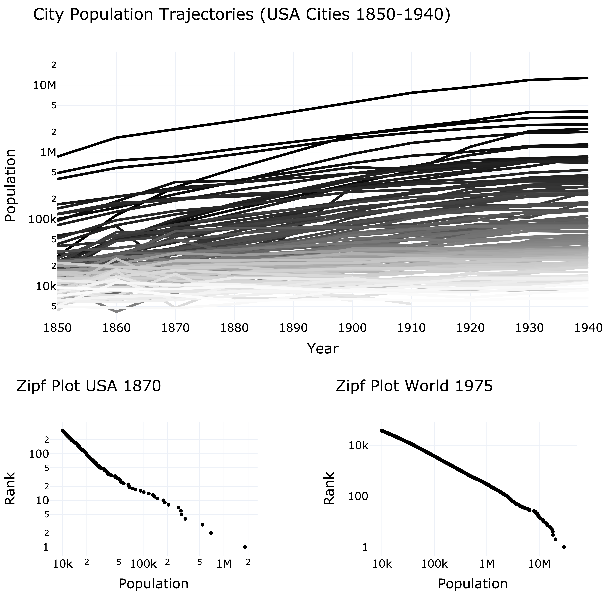
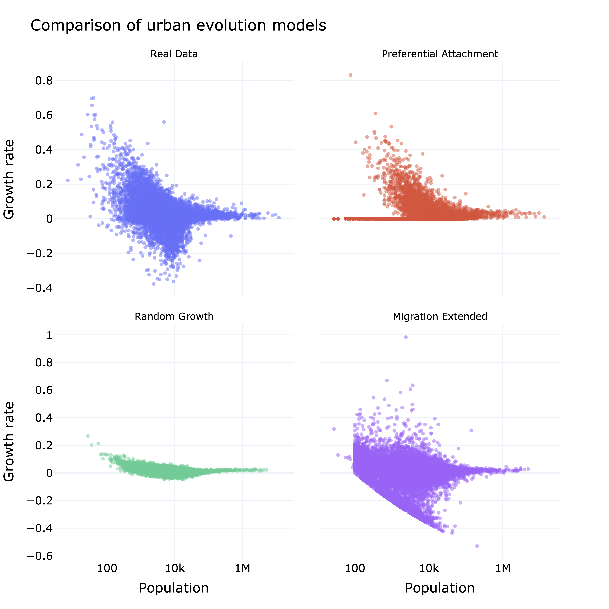

# EvolvingCities
EvolvingCities is a repository maintained by the Computational Social Science group at ETHZ. It is supported by the "Co-Evolving City Life - CoCi" project through the European Research Council (ERC) under the European Union’s Horizon 2020 research and innovation program (grant agreement No. 833168).

The repository contains code that powers data and models aimed at addressing the following overarching research question:

> How can we understand the dynamics and development of (networks of) participatory cities?
> 

In the following, we discuss the data and models contained in this repository. 

## Data pipeline

The first part of this repository contains a complex data pipeline that builds what we believe to be the most comprehensive dataset on evolving cities over time. This dataset features information on the population, geography, area, shape, and occupation profiles of cities, with extensive spatial and temporal coverage.

Specifically, the pipeline assembles two datasets:

**Global Cities**: This dataset features urban areas worldwide from 1975 to 2020. It is constructed using the European Union's Global Human Settlement Layer initiative, which provides 1 km x 1 km grids detailing population and urbanization levels, primarily based on building footprint data from satellite imagery [1]. We collected all available grids from 1975 to 2020 at five-year intervals.

Our pipeline transforms these grids into cities by clustering grid segments. It then matches these cities across time using a novel technique we developed based on network matchings. Finally, it assigns geocodes with country information and computes various measures detailing spatial interactions between cities, effectively constructing a network of co-evolving cities. 

**US Cities**: This dataset covers all recognized places in the US from 1850 to 1940. It was created by integrating data from the Census Place Project [2] with full count census data from the Integrated Public Use Microdata Service (IPUMS) [3], providing population figures for more than 40,000 "consistently defined places" over more than half a century. These places range from small farms to major cities like New York.

Our pipeline leverages the IPUMS full count census data for the US, including over 800 million individual-level records (1850-1940), reconstructs the growth and evolution of cities throughout this key period of urbanization and structural transformation in the US. The resulting dataset features basic city geographic information (location and area) and a wide range of socio-demographic variables, including population, occupation, industry, and inter-city migration. It provides a highly detailed account of the evolutionary dynamics of the US system of cities through a significant portion of its development.

These datasets form the backbone of our project. They are the building blocks that power our modeling efforts. Accurate and detailed data play a crucial role in fitting and evaluating models by providing the empirical foundation necessary for calibration and validation. By using these extensive datasets, we can fit new and existing models to best reflect the observed features of the evolutionary dynamics of city networks. The data also allows us to evaluate the predictions of such models and select the most informative ones.

From a software development perspective, our data pipeline is constructed using state-of-the-art tools, such as fast OLAP databases like DuckDB to process the millions of rows provided by the American census. It follows many pipeline best practices, such as idempotency and separation of concerns, and can be run simply on a Jupyter notebook.

The first part of this repository pipeline/ contains a complex data pipeline that builds the largest dataset about evolving cities over time. This dataset features information about the population, geography, area, shape and occupation profiles of cities around the world with an extensive spatial and temporal extent. 

### Figure 1

Caption: Figure 1 reports a map of the northeastern United States in 2020, according to the Global Cities dataset. 

### Figure 2

Caption: Figure 2 (Top) illustrates the population trajectories of US cities from 1850 to 1940. The color gradient reflects city populations in 1940, with darker shades indicating larger populations. We observe that while most cities grew in parallel, some experienced sudden and significant ascents in the urban population ranking. Figure 2 (Bottom) reports Zipf's law, a famous empirical regularity of systems of cities, for US cities in 1870 and all cities around the world in 1975.

## Models

The second part of this repository contains code to simulate some of the most prominent models of city co-evolution, along with extensions informed by our study of the data. These models draw on theories from mathematical ecology, dynamical systems, and stochastic calculus.

**Preferential Attachment Model**: The first model we implemented is Herbert Simon's preferential attachment model for the growth of cities [4]. Simon proposed this model to explain the fundamental mechanism underlying the growth and evolution of various biological and social systems. In the context of cities, it posits that urban expansion is more likely to occur near already large and growing areas, following the "rich-get-richer" principle.

**Random Growth Model**: We also implemented Gabaix's random growth model [5]. Gabaix suggests that the evolution of a system of cities can be modeled by a collection of independent geometric random walks. With specific assumptions on the moments of these random walks, Gabaix’s model aims to replicate various observations of city growth, particularly the distribution of city populations. This model finds parallels in biological and ecological systems, where random growth processes regulate inter-species interaction, generating distributions with a few numerous species coexisting with many smaller ones, mirroring city size distributions.

**Migration-Extended Model**: Additionally, we implemented a more recent model by Verbavatz and Barthelemy, which extends Gabaix's model by incorporating migration effects on urban dynamics [6]. Their framework accounts for population inflows and outflows between cities, recognizing migration as a key driver of urban dynamics. Their model includes terms for both natural population growth and migration flows, leading to a more comprehensive equation for city growth. This extended model better captures empirical urban growth patterns, demonstrating that migration significantly influences city size distributions and acknowledging that cities are interconnected through complex migration networks.

Our approach leverages the extensive data constructed in the first part of the project to fit the hyperparameters of these models. By calibrating the models with real-world data, we enhance the accuracy of the simulations and gain a better understanding of the mechanisms driving the evolutionary dynamics city networks. Specifically, these simulations inform us about the key mechanism underpinning the growth of urban networks, allowing us to explore how factors like migration, economic structure, and geography contribute to their coevolution. Through this data-driven approach, we aim to uncover the dynamic interactions between cities and provide insights into the processes shaping the complex landscape of urbanization.

From a software development perspective, these models are built as extensible classes, enabling future contributors to refine and build upon the current versions.

### Figure 3

Caption: A comparison of the growth rates by population generated by the Preferential Attachment, Random Growth, and Migration-Extended models. 
The models are fitted to the US cities dataset from 1850 to 1940.

### References
1. Schiavina M, Melchiorri M, Pesaresi M, Politis P, Freire S, Maffenini L, Florio P, Ehrlich D, Goch K, Tommasi P, Kemper T. GHSL data package 2022. Publications Office of the European Union: Luxembourg. 2022.
2. Berkes E, Karger E, Nencka P. The census place project: A method for geolocating unstructured place names. Explorations in Economic History. 2023 Jan 1;87:101477.
3. Ruggles S, Alexander JT, Genadek K, Goeken R, Schroeder MB, Sobek M. Integrated public use microdata series: Version 5.0. Minneapolis: University of Minnesota. 2010 May;42.
4. Simon HA. On a class of skew distribution functions. Biometrika. 1955 Dec 1;42(3/4):425-40.
5. Gabaix X. Zipf's law for cities: an explanation. The Quarterly journal of economics. 1999 Aug 1;114(3):739-67.
6. Verbavatz V, Barthelemy M. The growth equation of cities. Nature. 2020 Nov 19;587(7834):397-401.